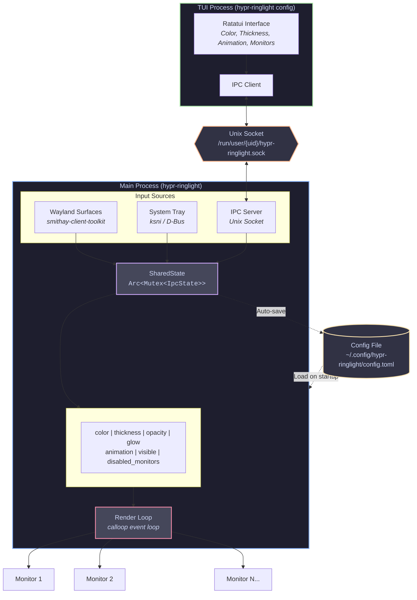

<h1 align="center">hypr-ringlight</h1>

<p align="center">
  <strong>A customizable ring light overlay for Hyprland/Wayland</strong>
</p>

<p align="center">
  <a href="#features">Features</a> •
  <a href="#demo">Demo</a> •
  <a href="#installation">Installation</a> •
  <a href="#usage">Usage</a> •
  <a href="#configuration">Configuration</a> •
  <a href="#architecture">Architecture</a> •
  <a href="#ipc-api">IPC API</a> •
  <a href="#license">License</a>
</p>

---

**hypr-ringlight** displays a glowing ring light effect around the edges of your screen(s). Inspired by the Edge Light feature introduced in macOS Sequoia.

> **Note**: This project is experimental and under active development.

## Demo

<p align="center">
  <a href="https://www.youtube.com/watch?v=LVvgnVlm1HI">
    
  </a>
</p>

<p align="center"><em>Click to watch the demo on YouTube</em></p>

## Features

- Smooth glow effect with customizable intensity
- Rounded inner corners for a polished look
- **Multi-monitor support** with per-monitor toggle
- **System tray integration** with full control
- **Interactive TUI configurator** with live preview
- **Multiple animations**: None, Pulse, Rainbow, Breathe, Wave
- **Click-through**: doesn't block mouse input or scrolling
- **IPC support** for scripting and automation
- Configurable thickness, color, opacity, and glow radius
- Persistent configuration (`~/.config/hypr-ringlight/config.toml`)
- Works with any Wayland compositor supporting `wlr-layer-shell`

## Requirements

- Hyprland (or any Wayland compositor with `wlr-layer-shell` support)
- System tray (e.g., Waybar with tray module)
- D-Bus (for tray integration)

## Installation

### From source

```bash
# Clone the repository
git clone https://github.com/stefanomainardi/hypr-ringlight.git
cd hypr-ringlight

# Build
cargo build --release

# Install system-wide (optional)
sudo cp target/release/hypr-ringlight /usr/local/bin/
```

### Dependencies

#### Arch Linux
```bash
sudo pacman -S rust dbus
```

#### Debian/Ubuntu
```bash
sudo apt install rustc cargo libdbus-1-dev pkg-config
```

#### Fedora
```bash
sudo dnf install rust cargo dbus-devel
```

## Usage

### Basic

```bash
# Start the ring light
hypr-ringlight

# Open the TUI configurator
hypr-ringlight config
```

### With custom options

```bash
# Red ring with rainbow animation
hypr-ringlight --color ff0000 --animation rainbow

# Thicker ring with more glow
hypr-ringlight --thickness 120 --glow 100

# Adjust for a bottom bar
hypr-ringlight --bar-position bottom --bar-height 40
```

### Interactive TUI Configurator

```bash
hypr-ringlight config
```

The TUI provides an interactive way to configure all ring light parameters with a Catppuccin-themed interface.

```
┌─────────────────────────────────────────┐
│          hypr-ringlight config          │
│                                  [LIVE] │
├─────────────────────────────────────────┤
│  > Ring Light: ON                       │
│    Color                                │
│    Thickness: 80                        │
│    Opacity: 100%                        │
│    Glow: 80                             │
│    Corner Radius: 2.5                   │
│    Animation: None                      │
│    Animation Speed: 120                 │
│    Monitors                             │
│    ──────────────                       │
│    Save & Exit                          │
│    Exit without saving                  │
└─────────────────────────────────────────┘
```

**Controls:**
| Key | Action |
|-----|--------|
| `↑/↓` or `j/k` | Navigate options |
| `←/→` or `h/l` | Adjust values |
| `Enter` | Select / Enter submenu |
| `Esc` | Go back / Exit |
| `q` | Quit |

**Live Preview:** If the ring light is already running, changes are applied in real-time. The TUI shows `[LIVE]` when connected or `[OFFLINE]` when the ring light isn't running.

## Configuration

### Command Line Options

| Option | Default | Description |
|--------|---------|-------------|
| `-c, --color` | `ffffff` | Ring color in hex format (e.g., `ff0000`) |
| `-t, --thickness` | `80` | Ring thickness in pixels |
| `-o, --opacity` | `1.0` | Ring opacity (0.0 - 1.0) |
| `-g, --glow` | `80` | Glow/blur radius in pixels |
| `--corner-radius` | `2.5` | Inner corner radius multiplier |
| `-a, --animation` | `none` | Animation: `none`, `pulse`, `rainbow`, `breathe`, `wave` |
| `--animation-speed` | `120` | Animation speed (lower = faster) |
| `--bar-height` | `35` | Height of your status bar in pixels |
| `--bar-position` | `top` | Bar position: `top`, `bottom`, `left`, `right` |

### Config File

Settings are stored in `~/.config/hypr-ringlight/config.toml`:

```toml
color = "89b4fa"
thickness = 80
opacity = 1.0
glow = 80
corner_radius = 2.5
animation = "none"
animation_speed = 120
bar_height = 35
bar_position = "top"
disabled_monitors = []
```

| Field | Type | Description |
|-------|------|-------------|
| `color` | String | Hex color without `#` prefix |
| `thickness` | Integer | Ring thickness in pixels (10-200) |
| `opacity` | Float | Opacity value (0.0-1.0) |
| `glow` | Integer | Glow radius in pixels (0-200) |
| `corner_radius` | Float | Corner radius multiplier (0.0-10.0) |
| `animation` | String | Animation mode |
| `animation_speed` | Integer | Animation speed (1-500) |
| `bar_height` | Integer | Status bar height compensation |
| `bar_position` | String | Status bar position |
| `disabled_monitors` | Array | List of disabled monitor names |

### System Tray

Right-click the tray icon to access:

| Menu Item | Description |
|-----------|-------------|
| **Show/Hide Ring** | Toggle visibility |
| **Width** | Preset sizes and fine adjustment (+5/-5) |
| **Animation** | Select animation mode |
| **Monitors** | Enable/disable per monitor |

Changes made from the tray are automatically saved to the config file.

## Architecture



### Component Overview

| Component | Description |
|-----------|-------------|
| **Wayland Surfaces** | Layer shell surfaces rendered on each monitor using `smithay-client-toolkit` |
| **System Tray** | D-Bus based tray icon using `ksni` crate |
| **IPC Server** | Unix socket server for inter-process communication |
| **SharedState** | Thread-safe state container (`Arc<Mutex<IpcState>>`) |
| **Render Loop** | Main event loop using `calloop` for frame scheduling |
| **TUI Process** | Separate process for configuration, communicates via IPC |

### Data Flow

1. **User Input** (Tray/TUI/CLI) modifies `SharedState`
2. **Render Loop** reads `SharedState` on each frame
3. **Wayland Surfaces** are redrawn with new parameters
4. **Config File** is updated when changes are saved

## IPC API

hypr-ringlight exposes a Unix socket at `/run/user/{uid}/hypr-ringlight.sock` for external control.

### Protocol

Send JSON commands terminated by newline. Responses are JSON objects.

### Commands

#### SetColor
```json
{"SetColor": "ff0000"}
```

#### SetThickness
```json
{"SetThickness": 100}
```

#### SetOpacity
```json
{"SetOpacity": 0.8}
```

#### SetGlow
```json
{"SetGlow": 120}
```

#### SetCornerRadius
```json
{"SetCornerRadius": 3.0}
```

#### SetAnimation
```json
{"SetAnimation": "rainbow"}
```
Values: `"none"`, `"pulse"`, `"rainbow"`, `"breathe"`, `"wave"`

#### SetAnimationSpeed
```json
{"SetAnimationSpeed": 80}
```

#### SetVisible
```json
{"SetVisible": true}
```

#### GetMonitors
```json
"GetMonitors"
```
Response:
```json
{
  "monitors": [
    {"name": "DP-1", "enabled": true},
    {"name": "HDMI-A-1", "enabled": false}
  ]
}
```

#### SetMonitorEnabled
```json
{"SetMonitorEnabled": {"monitor": "HDMI-A-1", "enabled": true}}
```

### Example: Shell Script Control

```bash
#!/bin/bash
SOCKET="/run/user/$(id -u)/hypr-ringlight.sock"

# Set color to red
echo '{"SetColor": "ff0000"}' | nc -U "$SOCKET"

# Enable rainbow animation
echo '{"SetAnimation": "rainbow"}' | nc -U "$SOCKET"

# Hide the ring
echo '{"SetVisible": false}' | nc -U "$SOCKET"

# Get monitor list
echo '"GetMonitors"' | nc -U "$SOCKET"
```

### Example: Python Integration

```python
import socket
import json
import os

def send_command(command):
    sock_path = f"/run/user/{os.getuid()}/hypr-ringlight.sock"
    with socket.socket(socket.AF_UNIX, socket.SOCK_STREAM) as s:
        s.connect(sock_path)
        s.send((json.dumps(command) + "\n").encode())
        return s.recv(1024).decode()

# Set thickness
send_command({"SetThickness": 120})

# Get monitors
response = send_command("GetMonitors")
print(json.loads(response))
```

## Autostart

### Hyprland

Add to `~/.config/hypr/hyprland.conf`:

```ini
exec-once = hypr-ringlight
```

### With custom options

```ini
exec-once = hypr-ringlight --color 00ffff --animation breathe --thickness 60
```

## Troubleshooting

| Issue | Solution |
|-------|----------|
| Ring doesn't appear | Ensure compositor supports `wlr-layer-shell` |
| Tray icon missing | Check if system tray is running (Waybar tray module) |
| Tray icon not working | Verify D-Bus: `systemctl --user status dbus` |
| High CPU usage | Expected during animations; use `--animation none` |
| TUI shows [OFFLINE] | Start the main ring light process first |
| Changes not persisting | Use "Save & Exit" in TUI or modify from tray |

## Tech Stack

| Crate | Purpose |
|-------|---------|
| `smithay-client-toolkit` | Wayland protocol bindings |
| `wayland-client` | Low-level Wayland communication |
| `calloop` | Event loop for frame scheduling |
| `ksni` | System tray (StatusNotifierItem) |
| `ratatui` | Terminal UI framework |
| `crossterm` | Terminal manipulation |
| `serde` / `serde_json` | Serialization |
| `toml` | Config file parsing |
| `clap` | Command line argument parsing |

## Contributing

Contributions are welcome! Please feel free to submit issues and pull requests.

## License

This project is licensed under the **GNU General Public License v3.0 or later** - see the [LICENSE](LICENSE) file for details.

---

<p align="center">
  Made with Rust for the Hyprland community
</p>
